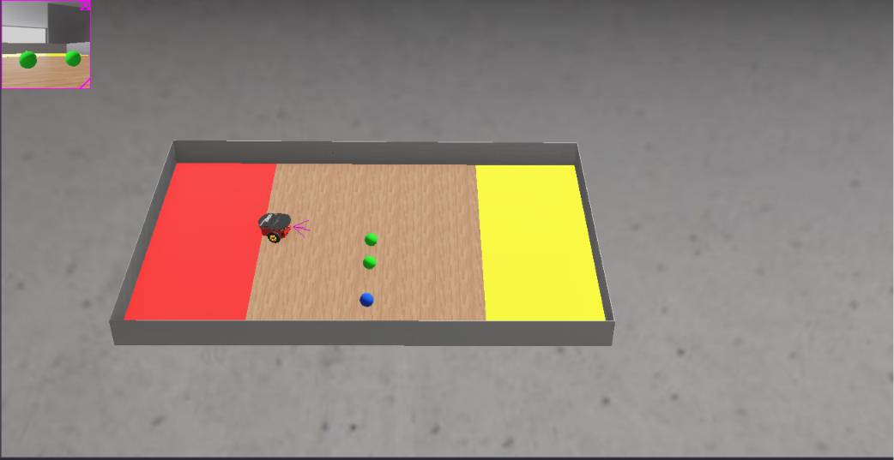
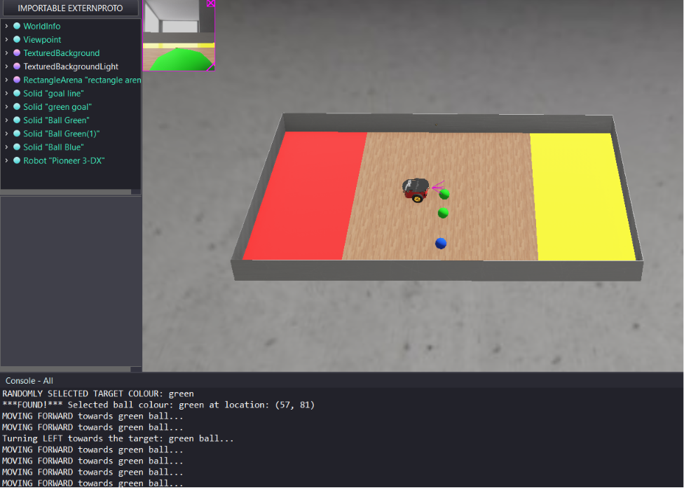
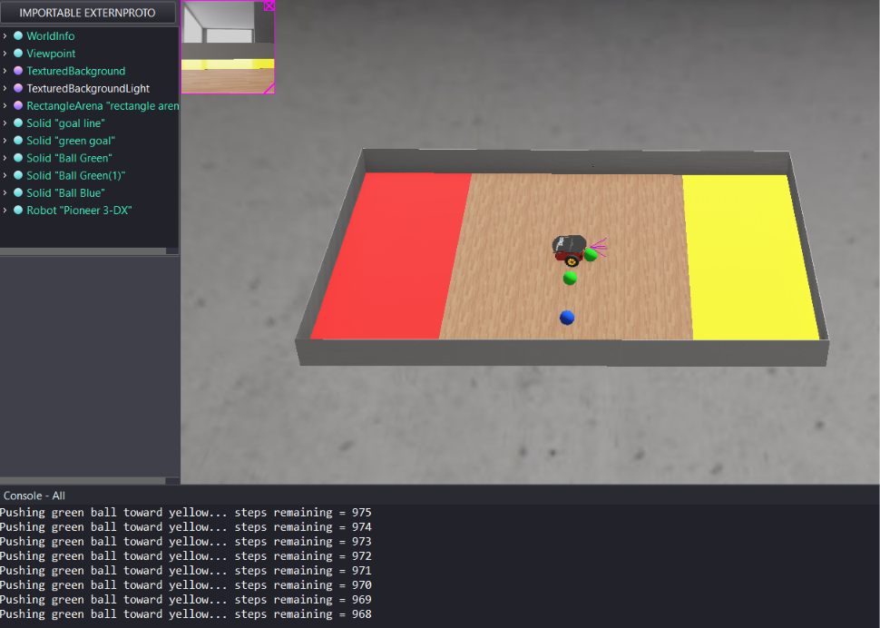
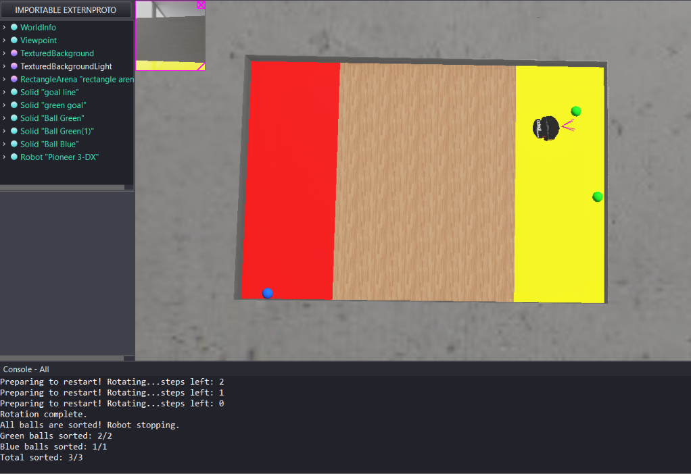

# Autonomous Ball Sorting Robot

A Webots-based autonomous mobile robot project developed in C for the Pioneer 3DX robot. The robot detects coloured balls using its embedded camera, selects a target colour, moves toward the target ball, and pushes it toward a detected goal zone using finite state machine logic.

## Overview

This project was completed as part of a university coursework. The goal was to develop a C-based Webots controller for a Pioneer 3DX mobile robot operating inside a simulated arena with coloured balls and coloured goal zones.

The robot uses camera-based RGB colour detection to identify green and blue balls, estimate the target ball position, and guide its movement. The controller uses a finite state machine to manage searching, moving, pushing, preparing for the next target, and stopping once the sorting process is complete.

## Features

- C-based Webots controller for the Pioneer 3DX robot
- Random first target colour selection
- RGB thresholding for green and blue ball detection
- Red and yellow goal-zone detection
- Camera-based centroid calculation
- Finite state machine control
- Camera-guided steering toward the target ball
- Fixed-step pushing behaviour toward the detected goal zone
- Sorted-ball counter with final console output

## Tools and Technologies

- C
- Webots
- Pioneer 3DX Robot
- Embedded camera
- Distance sensors
- RGB colour thresholding
- Centroid-based steering
- Finite state machine control

## System Operation

1. The robot starts in the Webots simulation environment and initializes the Pioneer 3DX motors, camera, LEDs, and distance sensors.
2. At the beginning of the run, the controller randomly selects either the green or blue ball as the first target colour.
3. The camera scans the arena and processes RGB pixel values to detect green balls, blue balls, red goal zones, and yellow goal zones.
4. The controller calculates the centroid and pixel size of the detected target ball to estimate its position and distance from the robot.
5. While searching, the robot rotates until the selected target ball appears in the camera frame.
6. Once the target ball is detected, the robot turns left or right based on the ball's position relative to the center of the camera image, then moves forward when aligned.
7. When the ball appears close enough, the robot pushes it forward toward the first visible goal zone detected by the camera.
8. After each ball is pushed, the robot rotates to prepare for the next search cycle and selects the next remaining ball colour.
9. When all target balls are processed, the robot stops and prints the final sorted-ball count to the console.

## Finite State Machine

The controller uses a finite state machine to manage robot behaviour:

- `SEARCHING_FOR_BALL` — rotates until the selected target colour is detected.
- `MOVING_TO_TARGET` — aligns with the ball using centroid position and moves forward.
- `PUSHING_TOWARDS_GOAL` — pushes the detected ball toward the visible goal zone.
- `PREPARATION` — rotates away and prepares for the next target.
- `COMPLETE` — stops the robot after all balls are sorted.

## My Contribution

- Programmed the robot controller in C.
- Implemented RGB thresholding for green and blue ball detection.
- Used camera image data to calculate ball centroid position.
- Developed finite state machine logic for searching, moving, pushing, preparation, and completion states.
- Implemented camera-guided steering based on the target ball's position in the image frame.
- Tested and adjusted movement behaviour across multiple simulation runs.

## Project Media

### Webots Environment

### Robot Detecting Ball

### Robot Pushing Ball

### Console Output

